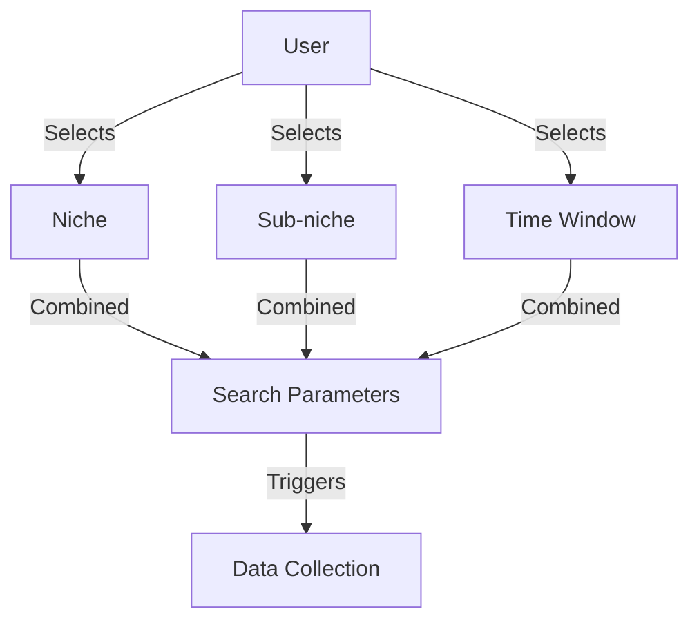
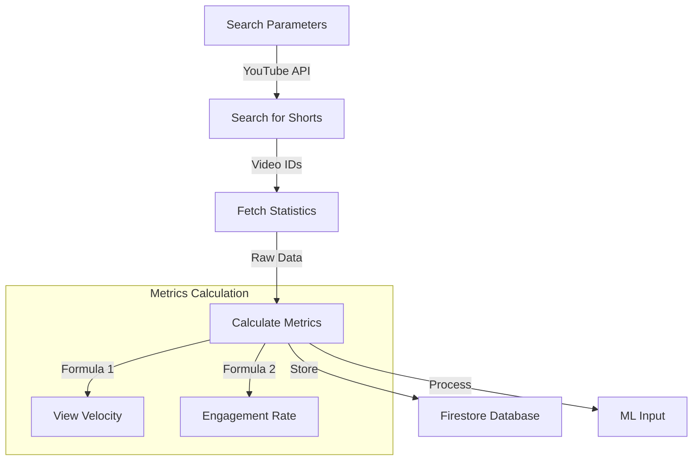
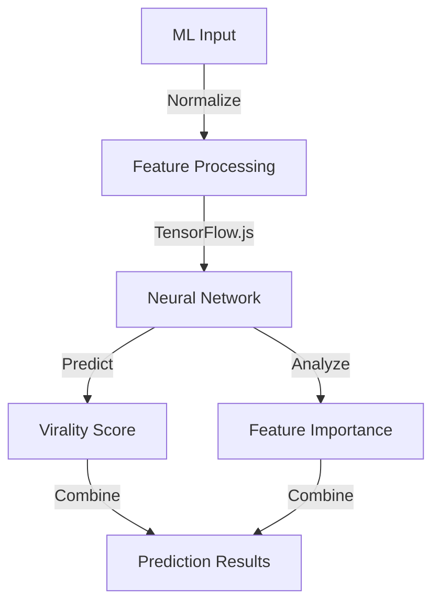
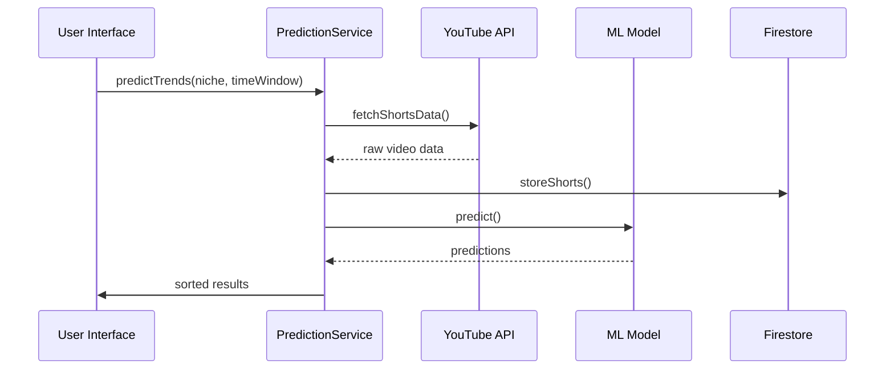
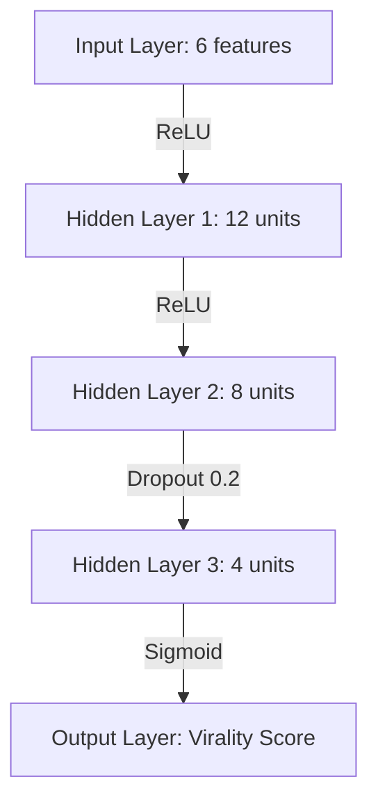
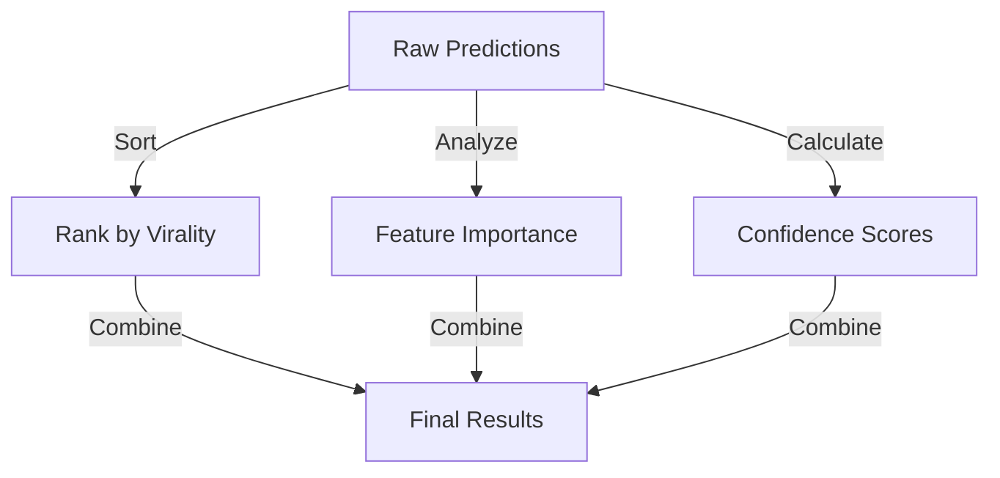

# YouTube Shorts Trend Prediction Algorithm Flow

## 1. User Input Flow


## 2. Data Collection Process


## 3. ML Pipeline


## 4. Data Flow


## 5. Feature Processing
- **Input Features**:
  * viewCount
  * likeCount
  * commentCount
  * shareCount
  * viewVelocity
  * engagementRate

- **Derived Metrics**:
  * viewVelocity = viewCount / hoursSincePublished
  * engagementRate = (likes + comments) / views
  * confidence = 1 - 2 * |0.5 - score|

## 6. Virality Thresholds
```typescript
const isViral = 
  viewVelocity > 1000 || // More than 1000 views per hour
  engagementRate > 0.1   // More than 10% engagement rate
```

## 7. Model Architecture


## 8. Output Processing
