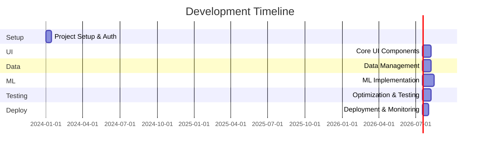

# Development Plan

## Stage 1: Project Setup and Authentication (1-2 weeks)

### 1.1 Initial Project Setup
1. Create new React + TypeScript project
2. Set up Firebase project
3. Configure development environment
4. Set up version control (Git)
5. Configure ESLint and Prettier

### 1.2 Authentication Implementation
1. Set up Firebase Authentication
2. Create authentication components:
   - Login form
   - Registration form
   - Password reset
3. Implement protected routes
4. Add authentication state management
5. Style authentication components

## Stage 2: Core UI Components (2-3 weeks)

### 2.1 Base Layout
1. Create main layout components
2. Implement responsive header
3. Set up routing structure
4. Add loading states
5. Implement error boundaries

### 2.2 Niche Selection Screen
1. Create niche card component
2. Implement niche grid layout
3. Add selection functionality
4. Create navigation logic
5. Add animations and transitions

### 2.3 Time Frame Selection Screen
1. Create time frame option components
2. Implement selection logic
3. Add back/next navigation
4. Create progress indicator
5. Add validation and error states

### 2.4 Results Screen
1. Create video list component
2. Implement video card component
3. Add filtering controls
4. Create loading states
5. Implement pagination

## Stage 3: Data Management (2-3 weeks)

### 3.1 Cache Implementation
```typescript
// Priority: High
1. Create cache service:
   - Implement CacheEntry interface
   - Add TTL management
   - Create cache invalidation logic
2. Add cache utilities:
   - Cache key generation
   - Cache entry validation
   - Cache cleanup
```

### 3.2 API Integration
```typescript
// Priority: High
1. Set up YouTube API client:
   - Configure API keys
   - Implement rate limiting
   - Add request bundling
2. Create data fetching services:
   - Implement RequestBundle interface
   - Add error handling
   - Create retry logic
```

### 3.3 State Management
1. Set up global state management
2. Implement request state handling
3. Add error management
4. Create loading states
5. Implement data persistence

## Stage 4: ML Implementation (3-4 weeks)

### 4.1 TensorFlow.js Setup
1. Add TensorFlow.js dependencies
2. Create ML model structure
3. Implement feature extraction
4. Add model training logic
5. Create prediction pipeline

### 4.2 Data Processing
1. Implement data normalization
2. Create feature engineering pipeline
3. Add data validation
4. Implement data transformation
5. Create data augmentation

### 4.3 Prediction System
1. Implement real-time prediction
2. Add confidence scoring
3. Create prediction caching
4. Implement batch processing
5. Add prediction validation

## Stage 5: Optimization and Testing (2-3 weeks)

### 5.1 Performance Optimization
1. Implement lazy loading
2. Add code splitting
3. Optimize bundle size
4. Implement request optimization
5. Add performance monitoring

### 5.2 Testing
1. Set up testing environment
2. Add unit tests
3. Implement integration tests
4. Add end-to-end tests
5. Create test automation

### 5.3 Error Handling
1. Implement global error handling
2. Add error reporting
3. Create error recovery
4. Implement fallback states
5. Add user feedback system

## Stage 6: Deployment and Monitoring (1-2 weeks)

### 6.1 Deployment Setup
1. Configure Firebase Hosting
2. Set up CI/CD pipeline
3. Configure environment variables
4. Add deployment scripts
5. Create backup procedures

### 6.2 Monitoring Implementation
1. Set up Firebase Analytics
2. Add performance monitoring
3. Implement error tracking
4. Create usage analytics
5. Add quota monitoring

### 6.3 Documentation
1. Create API documentation
2. Add code documentation
3. Create user guide
4. Add deployment guide
5. Create maintenance documentation

## Timeline Overview



## Resource Requirements

### Development Team
- 1 Frontend Developer (Full-time)
- 1 ML Engineer (Part-time/Consultant)
- 1 UI/UX Designer (Part-time)

### Infrastructure
- Firebase (Blaze Plan)
- YouTube API Quota
- Development Environment
- Testing Environment

## Risk Management

### High Priority Risks
1. YouTube API quota limitations
2. ML model accuracy
3. Cache performance
4. Data processing speed
5. User adoption

### Mitigation Strategies
1. Implement aggressive caching
2. Add fallback prediction methods
3. Use progressive loading
4. Implement quota monitoring
5. Add user feedback collection

## Success Metrics
1. API request efficiency (< 1000 requests/day)
2. Prediction accuracy (> 80%)
3. Page load time (< 2 seconds)
4. Cache hit rate (> 90%)
5. User retention (> 60%) 