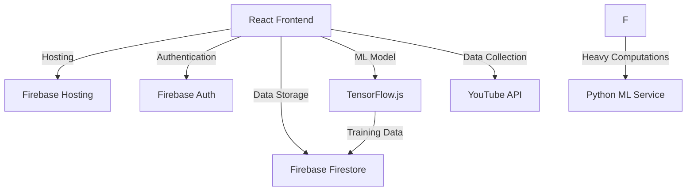
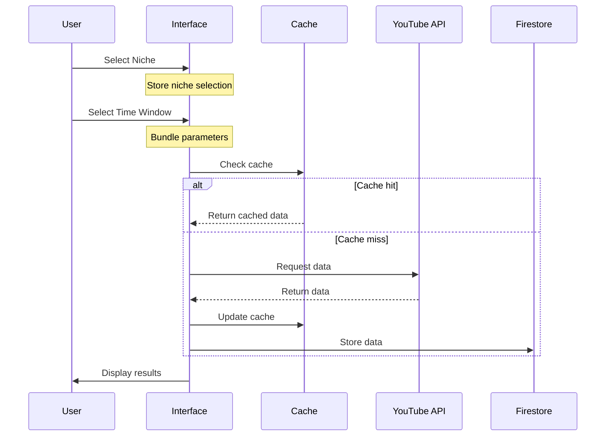

# YouTube Shorts Trend Predictor - Technical Specification

## 1. System Overview

### 1.1 Purpose
A web application that predicts the virality potential of YouTube Shorts within a 72-hour window, categorized by niches and time periods.

### 1.2 System Architecture


## 2. Core Components

### 2.1 Frontend Application (React + TypeScript)
- Single Page Application
- Protected routes
- YouTube-inspired UI design
- Responsive layout
- Real-time predictions display

### 2.2 Authentication System (Firebase)
- Email/password authentication
- Protected routes for authenticated users
- Session management
- User state persistence

### 2.3 Data Collection System
#### 2.3.1 Parameters
- View count
- Like count
- Comment count
- Share count
- View velocity (views per hour)
- Engagement rate
- Publishing time
- Niche category

#### 2.3.2 Time Windows
- Last 6 hours
- Last 12 hours
- Last 24 hours
- Last 48 hours

#### 2.3.3 Data Structure
```typescript
interface ShortData {
  videoId: string;
  title: string;
  publishedAt: Date;
  niche: string;
  metrics: {
    viewCount: number;
    likeCount: number;
    commentCount: number;
    shareCount: number;
    viewVelocity: number;
    engagementRate: number;
  };
  predictions: {
    viralityScore: number;
    timestamp: Date;
  }[];
  metadata: {
    thumbnailUrl: string;
    channelId: string;
    channelTitle: string;
  };
}
```

### 2.4 ML System (Hybrid Approach)

#### 2.4.1 Primary ML System (TensorFlow.js)
- Browser-based predictions
- Real-time analysis
- Features:
  * View velocity analysis
  * Engagement rate tracking
  * Time-based performance patterns
  * Niche-specific adjustments

```typescript
interface MLModel {
  inputFeatures: number;
  hiddenLayers: number[];
  outputFeature: 1; // Virality score (0-1)
  activationFunction: 'relu' | 'sigmoid';
  optimizer: 'adam';
  learningRate: 0.001;
}
```
## 3. User Interface Specifications

### 3.1 Customer Journey Map

#### 3.1.1 User Journey Steps
1. **Authentication**
   - User arrives at the landing page
   - Signs up/logs in using email and password
   - Success: Redirected to niche selection
   - Failure: Shows error message, retry option

2. **Niche Selection**
   - User presented with visual grid of niches
   - Each niche card shows:
     * Icon/illustration
     * Name
     * Brief description
     * Current number of trending videos
   - Single selection required
   - Prominent "Next" button
   - Ability to change selection later

3. **Time Frame Selection**
   - Clean, minimal interface
   - Four distinct options:
     * Last 6 hours
     * Last 12 hours
     * Last 24 hours
     * Last 48 hours
   - Visual representation of time windows
   - Clear selection indicator
   - "Back" and "Show Results" buttons

4. **Results View**
   - Loading state with progress indicator
   - List of trending Shorts
   - Quick filters:
     * Change niche (dropdown)
     * Change time frame (tabs)
   - Per video display:
     * Thumbnail
     * Title
     * Key metrics
     * Virality prediction
     * Direct link to video

#### 3.1.2 User Touchpoints
```typescript
interface UserTouchpoint {
  screen: 'auth' | 'niche' | 'timeframe' | 'results';
  actions: string[];
  userNeeds: string[];
  uiElements: string[];
  errorStates: string[];
}

const touchpoints: UserTouchpoint[] = [
  {
    screen: 'auth',
    actions: ['sign up', 'log in', 'password reset'],
    userNeeds: ['easy access', 'security', 'clear feedback'],
    uiElements: ['email input', 'password input', 'submit button', 'error messages'],
    errorStates: ['invalid credentials', 'network error', 'server error']
  },
  {
    screen: 'niche',
    actions: ['select niche', 'view niche details', 'proceed to next step'],
    userNeeds: ['clear categories', 'visual guidance', 'easy selection'],
    uiElements: ['niche grid', 'category cards', 'next button'],
    errorStates: ['no selection made', 'loading error']
  },
  {
    screen: 'timeframe',
    actions: ['select time window', 'go back', 'view results'],
    userNeeds: ['understand time impact', 'easy navigation', 'clear options'],
    uiElements: ['time options', 'navigation buttons', 'visual indicators'],
    errorStates: ['no selection made']
  },
  {
    screen: 'results',
    actions: ['view videos', 'change filters', 'access content'],
    userNeeds: ['quick insights', 'easy filtering', 'direct access'],
    uiElements: ['video list', 'filter controls', 'metric displays'],
    errorStates: ['no results', 'loading error', 'filter error']
  }
];
```

### 3.2 Screen Specifications

#### 3.2.1 Niche Selection Screen
```typescript
interface NicheCard {
  id: string;
  name: string;
  description: string;
  icon: string;
  trendingCount: number;
  selected: boolean;
}

interface NicheSelectionState {
  selectedNiche: string | null;
  nicheCategories: NicheCard[];
  loading: boolean;
  error: string | null;
}
```

#### 3.2.2 Time Frame Selection Screen
```typescript
interface TimeFrameOption {
  value: '6h' | '12h' | '24h' | '48h';
  label: string;
  description: string;
  selected: boolean;
}

interface TimeFrameState {
  selectedTimeFrame: string | null;
  previousNiche: string;
  loading: boolean;
}
```

#### 3.2.3 Results Screen
```typescript
interface ResultsState {
  niche: string;
  timeFrame: '6h' | '12h' | '24h' | '48h';
  videos: ShortData[];
  loading: boolean;
  error: string | null;
  filters: {
    sortBy: 'viralityScore' | 'publishTime' | 'viewCount';
    page: number;
    itemsPerPage: number;
  };
}
```

### 3.3 Layout Components
- Header with authentication status
- Main content area
- Filtering options
- Results display

### 3.4 Main Dashboard
```typescript
interface DashboardState {
  selectedNiche: string;
  timeWindow: '6h' | '12h' | '24h' | '48h';
  sortBy: 'viralityScore' | 'publishTime' | 'viewCount';
  displayMode: 'list';
}
```

### 3.5 Content Display
- List view of trending Shorts
- Per item display:
  * Thumbnail
  * Title
  * Current metrics
  * Virality prediction percentage
  * Direct link to video

## 4. Data Flow

### 4.1 Optimized Data Collection Strategy

#### 4.1.1 Request Parameters Bundle
```typescript
interface RequestParameters {
  niche: string;
  timeWindow: '6h' | '12h' | '24h' | '48h';
  timestamp: Date;
}

interface CacheKey {
  niche: string;
  timeWindow: string;
  timestamp: string;
}
```

#### 4.1.2 Caching Strategy
```typescript
interface CacheEntry {
  data: ShortData[];
  expiresAt: Date;
  requestParams: RequestParameters;
}

interface CacheConfig {
  // Cache duration per time window
  ttl: {
    '6h': 1800000,  // 30 minutes
    '12h': 3600000, // 1 hour
    '24h': 7200000, // 2 hours
    '48h': 14400000 // 4 hours
  };
  maxEntries: 20; // Maximum cache entries
}
```

#### 4.1.3 Request Flow
1. **Parameter Collection**
   - Wait for user to select niche
   - Wait for user to select time window
   - Bundle parameters into request object

2. **Cache Check**
   - Generate cache key from parameters
   - Check if valid cached data exists
   - Return cached data if valid

3. **API Request**
   - Only triggered when:
     * User has selected both niche and time window
     * No valid cache exists
     * User explicitly refreshes data

4. **Data Processing**
   - Process only requested time window
   - Store processed data in cache
   - Update ML model with new data

### 4.2 API Request Optimization

#### 4.2.1 Request Bundling
```typescript
interface RequestBundle {
  niche: string;
  timeWindows: {
    start: Date;
    end: Date;
  };
  maxResults: number;
  pageToken?: string;
}
```

#### 4.2.2 Rate Limiting
```typescript
interface RateLimitConfig {
  maxRequestsPerMinute: number;
  maxRequestsPerDay: number;
  cooldownPeriod: number;
  priorityQueue: boolean;
}
```

#### 4.2.3 Request States
```typescript
type RequestState = 
  | 'PENDING_PARAMETERS'  // Waiting for user input
  | 'PARAMETERS_READY'    // Both niche and time window selected
  | 'CHECKING_CACHE'      // Looking for cached data
  | 'FETCHING_DATA'       // Making API request
  | 'PROCESSING_DATA'     // Processing response
  | 'COMPLETE'           // Data ready for display
  | 'ERROR';            // Request failed

interface RequestStatus {
  state: RequestState;
  progress?: number;
  error?: string;
  lastUpdated?: Date;
}
```

### 4.3 Data Flow Sequence



## 5. Implementation Phases

### Phase 1: Foundation
- Firebase project setup
- Authentication system
- Basic UI implementation
- YouTube API integration

### Phase 2: Data Collection
- Data collection service
- Firestore database setup
- Scheduled jobs implementation
- Data processing pipeline

### Phase 3: ML Implementation
- TensorFlow.js model development
- Initial training pipeline
- Basic prediction system
- Real-time analysis implementation

### Phase 4: Advanced Features
- Cloud Run service setup
- Python ML service implementation
- Model optimization
- Performance improvements

### Phase 5: Production Readiness
- Error handling
- Performance optimization
- Security enhancements
- Production deployment

## 6. Technical Requirements

### 6.1 Frontend
- React 18+
- TypeScript 4+
- TensorFlow.js
- Firebase SDK

### 6.2 Backend Services
- Firebase (Hosting, Auth, Firestore)
- Cloud Run (Optional)
- Python 3.9+ (for Cloud Run service)
- Docker (for Cloud Run service)

### 6.3 APIs
- YouTube Data API v3
- Firebase Admin SDK
- Cloud Run API (if used)

### 6.4 Development Tools
- Node.js 16+
- npm/yarn
- Git
- VS Code (recommended)

## 7. Security Considerations

### 7.1 Authentication
- Firebase Authentication
- JWT token management
- Session handling

### 7.2 Data Protection
- Firestore security rules
- API key protection
- Rate limiting

### 7.3 API Security
- YouTube API quota management
- Request validation
- Error handling

## 8. Monitoring and Maintenance

### 8.1 Performance Monitoring
- Firebase Performance Monitoring
- ML model accuracy tracking
- API quota usage monitoring

### 8.2 Error Tracking
- Firebase Crashlytics
- Error logging
- User feedback collection

### 8.3 Updates and Maintenance
- Model retraining schedule
- Data cleanup policies
- Version control
- Backup procedures

## 9. Future Considerations

### 9.1 Potential Extensions
- Additional ML features
- User preferences
- Advanced analytics
- Mobile app version

### 9.2 Scalability
- Increased data processing
- Additional niches
- User base growth
- Performance optimization 